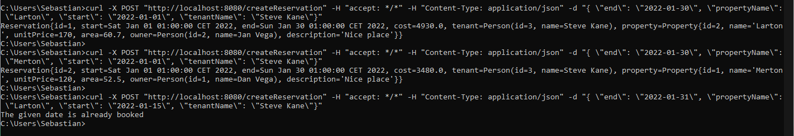
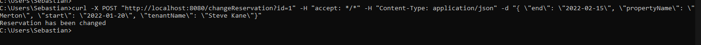
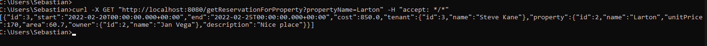
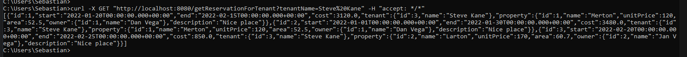

# **Reservation-Services**

Usługi rest są dostępne pod adresami:

[http://localhost:8080/createReservation](http://localhost:8080/getReservationForTenant)

[http://localhost:8080/changeReservation](http://localhost:8080/getReservationForTenant)

[http://localhost:8080/getReservationForProperty](http://localhost:8080/getReservationForTenant)

[http://localhost:8080/getReservationForTenant](http://localhost:8080/getReservationForTenant)

Lub używając swaggera:

[http://localhost:8080/swagger-ui/](http://localhost:8080/swagger-ui/)

## **Przykładowe wywołania usług**

##### createReservation

##### changeReservation

##### getReservationForProperty

##### getReservationForTenant
